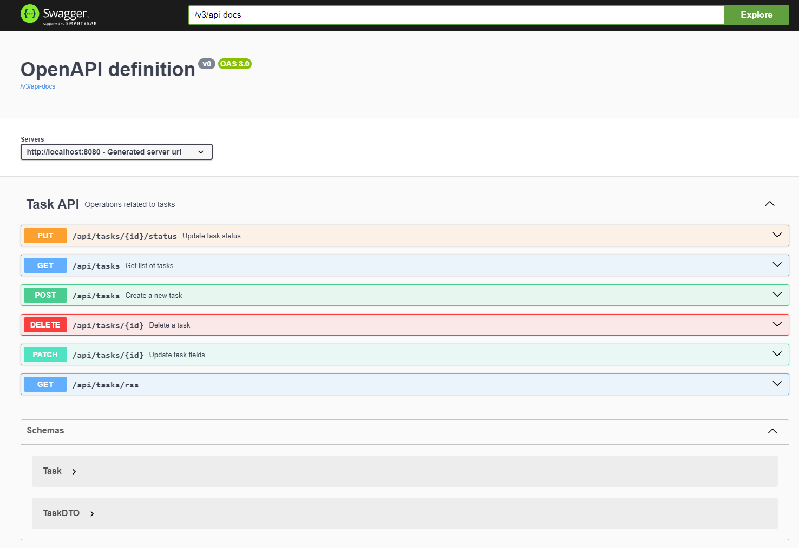
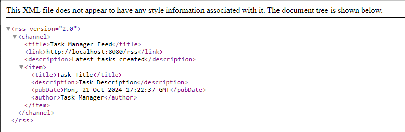
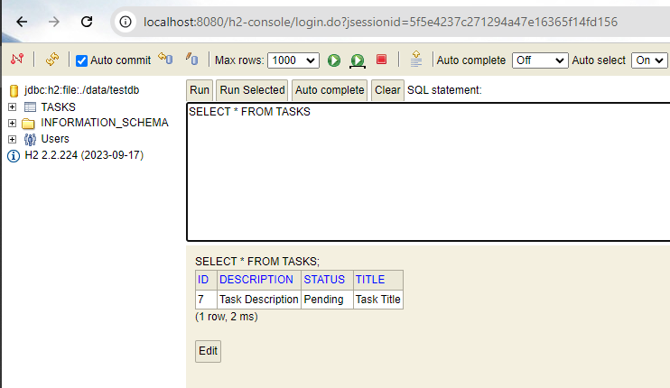
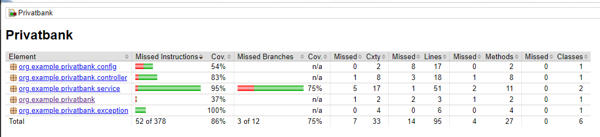

# Task Manager 

The Privatbank application is a Spring Boot-based project designed to manage tasks and generate RSS feeds from the tasks stored in the system. It provides a simple task management system where tasks can be created, updated, viewed, and deleted, with the added functionality of converting these tasks into RSS feeds for easy syndication.

## Requirements

- Java 17 or higher
- Maven
- Spring Boot
- H2
- Postgres
- Docker
- Docker Compose
- Lombok
- Jacoco
- Rome

## Getting Started

Follow the steps below to start the project from the console:

### 1. **Clone the repository**


```bash
git clone https://github.com/RomanPilyushin/Privatbank.git
cd Privatbank
````

### 2. **Run the application**


```bash
docker-compose up --build
````


### 3. **Access the application**

- URL: [http://localhost:8080/](http://localhost:8080/)

Once the application is running, you can access the following functionality via a web browser:

#### Swagger UI

Swagger UI provides a user-friendly interface for exploring the API endpoints and their documentation.

- URL: [http://localhost:8080/swagger-ui/index.html](http://localhost:8080/swagger-ui/index.html)



#### RSS

You can check the rss-feed of the application using the endpoint.

- URL: [http://localhost:8080/api/tasks/rss](http://localhost:8080/api/tasks/rss)



#### H2 Console

You can check the H2 database using the browser.

- URL: [http://localhost:8080/h2-console/](http://localhost:8080/h2-console/)



### 4. **Stop the application**


```bash
docker-compose down
````

### **5. Custom Configuration**

**Database**: By default, the application uses Postgres database. You can configure it to use another database by updating the `application.properties` file.

`postgres:5432`

**Port Configuration**: The application runs on port 8080 by default. You can change this by adding the following property in `application.properties`:

`server.port=8080`

## REST API Commands with Descriptions

### 1. Create Task

- **Method**: POST
- **Endpoint**: `/api/tasks`
- **Input**: JSON object representing the new task

````json
{
  "title": "Task Title",
  "description": "Task Description",
  "status": "Pending"
}
````

- **Output**: The created task with its assigned ID

### 2. Delete Task

- **Method**: DELETE
- **Endpoint**: `/api/tasks/{id}`
- **Input**: Task ID in the URL path
- **Output**: Confirmation of successful deletion (HTTP 200 OK)

### 3. Update Task Status

- **Method**: PUT
- **Endpoint**: `/api/tasks/{id}/status`
- **Input**:
   - Task ID in the URL path
   - `status` as a request parameter
- **Example**: `/api/tasks/1/status?status=Completed`
- **Output**: The updated task with the new status

### 4. Update Task Fields

- **Method**: PATCH
- **Endpoint**: `/api/tasks/{id}`
- **Input**:

   - Task ID in the URL path
   - JSON object with fields to update


````json
{
   "title": "Updated Title",
   "description": "Updated Description"
}
````

- **Output**: The updated task with the changed fields

### 5. Get List of Tasks

- **Method**: GET
- **Endpoint**: `/api/tasks`
- **Input**: None
- **Output**: List of all tasks in JSON format


## Project Structure

```bash

Privatbank/
├── .idea/                            # IDE-specific files
├── .mvn/                             # Maven wrapper files
├── data/                             # Data directory (presumably for storing test or sample data)
├── invalid/                          # Additional directory (possibly for invalid or temporary data)
├── src/                              # Source files
│   ├── main/                         # Main application source files
│   │   ├── java/                     
│   │   │   └── org.example.privatbank/       # Main application package
│   │   │       ├── controller/              # REST controllers
│   │   │       │   └── TaskController       # Controller handling task-related operations
│   │   │       ├── model/                   # Model classes representing entities
│   │   │       │   └── Task                 # Task entity representing a task
│   │   │       ├── repository/              # Repository interfaces for database interaction
│   │   │       │   └── TaskRepository       # Repository for task entities
│   │   │       ├── service/                 # Service layer containing business logic
│   │   │       │   ├── RssFeedService       # Service for generating RSS feeds from tasks
│   │   │       │   └── TaskService          # Service handling task business logic
│   │   │       └── PrivatbankApplication    # Main Spring Boot application class
│   │   └── resources/                       
│   │       ├── application.properties       # Configuration properties for the application
│   │       └── logback.xml                  # Logback configuration for logging
│   └── test/                                # Test classes
│       └── org.example.privatbank/          
│           ├── RssFeedServiceTest           # Unit test for RssFeedService
│           ├── TaskControllerTest           # Unit test for TaskController
│           ├── TaskRepositoryTest           # Unit test for TaskRepository
│           └── TaskServiceTest              # Unit test for TaskService
├── target/                            # Compiled output files and generated sources
├── .gitignore                         # Git ignore file
├── Dockerfile                         # Dockerfile for containerizing the application
├── docker-compose.yml                 # Docker Compose configuration for orchestrating containers
├── mvnw                               # Maven wrapper script (Linux/macOS)
├── mvnw.cmd                           # Maven wrapper script (Windows)
├── pom.xml                            # Maven configuration file
└── README.md                          # Project documentation

````

## Test Coverage

Test coverage for the **Privatbank** application can be found in the following location:

**Jacoco Report**: The application uses **Jacoco** for generating code coverage reports during the testing process. After running the tests, a detailed report of the test coverage can be found at:
````bash
target/site/jacoco/index.html
````



## Key Features:

1. **Task Management**:

    - The application offers CRUD operations for tasks. Users can create tasks, update their details and statuses, view all tasks, and delete tasks.
    - Tasks are represented by a `Task` model, which contains information like the title, description, and status.
2. **RSS Feed Generation**:

    - The application includes an `RssFeedService` that allows tasks to be converted into RSS feed items. This enables the syndication of task updates and provides a way to view tasks in an RSS reader.
    - Each task is added to a feed, which is generated and can be served to clients as an RSS feed.
3. **REST API**:

    - The task management operations are exposed via a REST API through the `TaskController` class. This API allows clients to interact with the system programmatically, making it possible to create, update, retrieve, and delete tasks over HTTP.
4. **PostgreSQL and H2 Database Support**:

    - The application uses a PostgreSQL database in production and an H2 in-memory database for development and testing. The data is managed through the `TaskRepository`, which interacts with the database using Spring Data JPA.
5. **Docker Support**:

    - The project includes a `Dockerfile` and `docker-compose.yml` configuration, which make it easy to containerize the application and orchestrate it with other services like PostgreSQL. Docker Compose helps in managing multi-container applications.
6. **Testing**:

    - Unit tests are provided for the service, controller, and repository layers of the application to ensure that the core functionalities, such as task management and RSS feed generation, work as expected. The project uses JUnit 5 for testing and Mockito for mocking dependencies.
7. **Logging**:

    - The application is configured with Logback for logging, allowing for efficient tracking of application behavior and debugging.

### Main Components:

- **Task**: Represents a task entity with attributes like `title`, `description`, and `status`.
- **TaskController**: Exposes RESTful endpoints for managing tasks.
- **TaskService**: Contains the business logic for handling task-related operations.
- **TaskRepository**: Handles database interactions for storing and retrieving task data.
- **RssFeedService**: Responsible for creating and managing RSS feeds from tasks.

### Application Workflow:

1. Users or clients can interact with the REST API to perform task operations, such as creating a new task, updating an existing task's status, retrieving all tasks, or deleting a task.
2. The application stores task data in a PostgreSQL (or H2) database.
3. The RSS feed service can aggregate tasks and generate an RSS feed, allowing users to subscribe and receive updates on task changes.
4. The application is designed to be containerized using Docker, making deployment and scaling easier.

This app is ideal for simple task management and use cases where task updates need to be syndicated via RSS. The extensible architecture allows easy integration with other systems and can be scaled based on needs.


